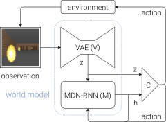
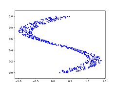
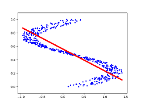
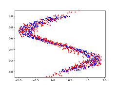
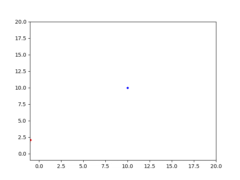
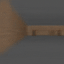
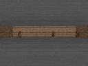

# World Models Implementation In Chainer
This is a fairly complete implementation, in [Chainer](https://chainer.org), of the World Models framework described by David Ha and Jürgen Schmidhuber: https://arxiv.org/abs/1803.10122

This project was created as part of my MSc Artificial Intelligence dissertation at the University of Edinburgh, under the supervision of [Subramanian Ramamoorthy](http://homepages.inf.ed.ac.uk/sramamoo/), with guidance from fellow PhD student [Svetlin Penkov](https://www.linkedin.com/in/svpenkov/). The scope of my research is model-based learning. Particularly, investigating the use of external memory available to a RNN to learn complex models. And thus I will be extending this framework accordingly, though these extensions are not present in this repository.

>  My best trained World Models agent playing [CarRacing-v0](https://gym.openai.com/envs/CarRacing-v0/).

## World Models Summary

Here is a quick summary of Ha & Schmidhuber's World Models framework. The framework aims to train an agent that can perform well in virtual gaming environments. Ha & Schmidhuber's experiments were done in the [CarRacing-v0](https://gym.openai.com/envs/CarRacing-v0/) (from [OpenAI gym](https://gym.openai.com/)), and [ViZDoom: Take Cover](https://github.com/mwydmuch/ViZDoom/tree/master/scenarios#take-cover) environments.

World Models consists of three main components: Vision (**V**), Model (**M**), and Controller (**C**) that interact together to form an agent:

> 
 
**V** consists of a convolutional [Variational Autoencoder (VAE)](https://arxiv.org/abs/1606.05908), which compresses frames taken from the gameplay into a latent vector *z*. **M** consists of a [Mixture Density Network (MDN)](https://publications.aston.ac.uk/373/1/NCRG_94_004.pdf), which involves outputting a [Mixture Density Model](https://en.wikipedia.org/wiki/Mixture_model) from a [Recurrent Neural Network (RNN)](https://en.wikipedia.org/wiki/Recurrent_neural_network). This MDN-RNN takes latent vectors *z* from **V** and predicts the next frame. And finally **C** is a simple single layer linear model that maps the output from **M** to actions to perform in the environment. **C** is trained using [Evolution Strategies](https://blog.openai.com/evolution-strategies/), particularly the [CMA-ES](https://arxiv.org/abs/1604.00772) algorithm.

Most interesting (to me, at least) are the MDN-RNN used by **M**, and CMA-ES used by **C**, which are briefly summarized here.

###### MDN
[Mixture Density Networks](https://publications.aston.ac.uk/373/1/NCRG_94_004.pdf) were developed by [Christopher Bishop](https://en.wikipedia.org/wiki/Christopher_Bishop) (who received his PhD from the University of Edinburgh). MDNs combine a mixture density model with a neural network. The goal of the neural network is to, rather than output a desired result directly, output the parameters of a mixture model which can be used to sample from to get the ultimate output. The parameters the neural network outputs include a set of probabilities, set of means, and set of standard deviations. 

This approach is particularly useful when the desired output cannot simply be the average of likely correct outputs. In such data, mean square error (MSE) will not work. Take for example the toy problem below:
> 
 
The blue dots represent the desired y value given an x value. So at x=0.25, y could be {0, 0.5, 1} (roughly), but it might not make sense to be the average of the three.

If trying to predict the outputs directly through a simple feedforward neural network using MSE, here's what we get:
> 

Instead, if we use a simple MDN and sample from it, we get a good fit:
> 

*The code for this toy problem is available in [toy/mdn.py](toy/mdn.py).*

###### CMA-ES
According to OpenAI, [Evolution Strategies are a scalable alternative to Reinforcement Learning](https://arxiv.org/abs/1703.03864). Where Reinforcement Learning is a guess and check on the actions, Evolution Strategies are a guess and check on the model parameters themselves. A "population" of "mutations" to seed parameters is created, and all mutated parameters are checked for fitness, and the seed adjusted towards the mean of the fittest mutations. [CMA-ES](https://arxiv.org/abs/1604.00772) is a particular evolution strategy where the covariance matrix is adapted, to cast a wider net for the mutations, in an attempt to search for the solution.

To demonstrate, here is a toy problem. Consider a shifted [Schaffer](https://en.wikipedia.org/wiki/Test_functions_for_optimization) function with a solution at (10,10). So the parameters values being sought should be (10,10). We can have our fitness function return the square error between the parameters being tested, and the actual solution, against the Schaffer function. The animation below depicts how CMA-ES creates populations of parameters that are tested against the fitness function. The blue dot represents the solution. The red dots the entire population being tested. And the green dot the mean of the population as it evolves, which eventually fits the solution. You see the "net" the algorithm casts (the covariance matrix) from which the population is sampled, is adapted as it is further or closer to the solution based on the fitness score. How cool!
 
> 

*The code for this toy problem is available in [toy/cma-es.py](toy/cma-es.py). I translated the *(mu/mu_w, lambda)-CMA-ES* algorithm to Python as simply as I could.* 

## Results

Available to me is a cluster powered with NVidia 1060 Ti GPUs. And a CPU cluster consisting of 12 machines with 40-48 CPUs per machine. Unfortunately, the machines on the CPU cluster do not have GPUs, which would speed up training for the controller.

All setup and hyperparameters were kept exactly the same as Ha & Schmidhuber's, except where they were not explicit. For example, 10,000 rollouts were used to collect frames to train **V**, 5 mixture models were used in MDN-RNN, N_z was set to 32 and 64 for CarRacing-v0 and ViZDoom: Take Cover respectively, and so on. 

###### CarRacing-v0

Task is considered solved if the average score over 100 consecutive rollouts is greater than 900.

* **Random agent**: Mean score -72 +/- 3 over 100 rollouts
* **Trained agent**: Mean score 753 +/- 13 over 100 rollouts*  
**Ended controller training early due to time constraints--will run longer and update final results* 

###### ViZDoom: Take Cover

Task is considered solved if the average score over 100 consecutive rollouts is greater than 750.
 
* **Random agent**: Mean score 278 +/- 100 over 100 rollouts
* **Trained agent**: Mean score 680 +/- 411 over 100 rollouts*  
**Ended controller training early due to time constraints--will run longer and update final results*

>  An agent roaming around in its dream.

>  An agent trained in its dream playing the actual game.

## Usage

### Setup

* `conda install numpy chainer scipy Pillow imageio numba cupy`  *(cupy if using GPU)*  
* `pip install gym Box2D vizdoom` *(ViZDoom build [pre-setup](https://github.com/mwydmuch/ViZDoom/blob/master/doc/Building.md))* 

### Running

Some base notes:
* The OpenAI gym file [car_racing.py](https://github.com/openai/gym/blob/master/gym/envs/box2d/car_racing.py) has a bug. Edit it in your local environment with my proposed: [solution](https://github.com/openai/gym/issues/976#issuecomment-395486438).
* Prepend *xvfb-run -e /dev/stdout -s "-screen 0 1400x900x24"* to #1, #4, and #5 if running headlessly on a server, for CarRacing-v0.
* *--data_dir* defines the base directory where all output (results, snapshots, samples, etc) are stored.
* In most cases, samples are generated throughout training and placed in the output folder.
* In most cases, sub-processes equal to the number of CPU cores are fired off for parallelization, and can be changed by using the *--cores* argument.
* GPU support is coded in most cases, using the *--gpu* or *--gpus* flags.
* *--snapshot_interval* defines the interval to keep snapshots through training for #2-#4, which can be used to resume.
* Ha & Schmidhuber used [DoomTakeCover-v0](https://gym.openai.com/envs/DoomTakeCover-v0/) from OpenAI gym, which appears to be deprecated. So I wrote my own simple wrapper directly to ViZDoom and loaded the *Take Cover* configuration. 

### 1. Random Rollouts

`python random_rollouts.py --game CarRacing-v0 --num_rollouts 10000`  
or  
`python random_rollouts.py --game DoomTakeCover --num_rollouts 10000`

**Notes:**
* Perform random rollouts to record gameplay to train the components.

### 2. Vision (V)

`python vision.py --game CarRacing-v0 --z_dim 32 --epoch 1`  
or  
`python vision.py --game DoomTakeCover --z_dim 64 --epoch 1`  

**Notes:**
* Main hurdle was fitting all frames from 10,000 rollouts in memory. In the case of CarRacing-v0, that's 10 million frames. So I implemented parallelized batched loading of frames.
* You'll want to adjust *--load_batch_size* according to the memory you have available. A low setting in low memory is fine but will be slower.

### 3. Model (M)

`python model.py --game CarRacing-v0 --z_dim 32 --hidden_dim 256 --mixtures 5 --epoch 20`  
or  
`python model.py --game DoomTakeCover --z_dim 64 --hidden_dim 512 --mixtures 5 --predict_done --epoch 20`

**Notes:**

* At the end of training, a dream rollout is generated just for fun.

### 4. Controller (C)

`python controller.py --game CarRacing-v0 --lambda_ 64 --mu 0.25 --trials 16 --target_cumulative_reward 900 --z_dim 32 --hidden_dim 256 --mixtures 5 --temperature 1.0 --weights_type 1 [--cluster_mode]`  
or  
`python controller.py --game DoomTakeCover --lambda_ 64 --mu 0.25 --trials 16 --target_cumulative_reward 2050 --z_dim 64 --hidden_dim 512 --mixtures 5 --temperature 1.15 --weights_type 2 --in_dream --dream_max_len 2100 --initial_z_noise 0.5 --predict_done --done_threshold 0.5 [--cluster_mode]`

**Notes:**
* *--cluster_mode* allows you to split a generation of CMA-ES over a compute cluster. 
    * A dispatcher is set in the *CLUSTER_DISPATCHER* variable, and workers in *CLUSTER_WORKERS* (the hostnames or IPs). 
    * The full generation of 64 mutations will dynamically adjust to run on all cores on all machines, to evenly spread the load. 
    * Start controller.py on all the worker nodes first, then the dispatcher node. 
    * Make sure a firewall is not blocking the ports configured in the *_PORT variables in controller.py. 
* Not sure what *mu* value was used for CMA-ES, but David Ha's blog posts on other experiments seem to indicate her prefers 25%, so I used 0.25 with good results.
* Training the controller will take a while (on the scale of days or weeks)! Even with multiple GPUs and clusters of CPUs (both together would be ideal, though not tested).
* For dream training, I had to add noise to the initial frame picked from a real game (*--initial_z_noise*), in order for it to have a higher variety of scenarios. This is different than Ha & Schmidhuber as far as I know.
* Since the controller can take excessively long to train, I added a simple form of curriculum learning to speed it up, which is also different than Ha & Schmidhuber. To set, use the *--curriculum* flage. For CarRacing-v0, "50,5" (initial max timesteps 50, increase by 5 when average cumulative score increases over a generation) allows it to learn the game progressively and seems to work well. For DoomTakeCover, try "500,10". 
* After your controller is trained, celebrate by proclaiming [Evolution Complete!](https://coub.com/view/o8exp)

### 5. Test

`python test.py --game CarRacing-v0 --z_dim 32 --hidden_dim 256 --mixtures 5 --temperature 1.0 --weights_type 1 --rollouts 100 [--record]`  
or  
`python test.py --game DoomTakeCover --z_dim 64 --hidden_dim 512 --mixtures 5 --temperature 1.15 --weights_type 2 --predict_done --rollouts 100 [--record]`

**Notes:**
* Take your final "agent" (trained V + M + C) for a spin.
* It will report back the mean score and standard deviation over the desired number of *--rollouts*.
* *--record* will save all rollouts as gifs.

## License

The original research for World Models was conducted by Ha & Schmidhuber, but this code is entirely written by myself (Adeel Mufti). I am releasing it under the [MIT](https://opensource.org/licenses/MIT) license.